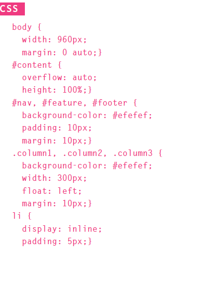
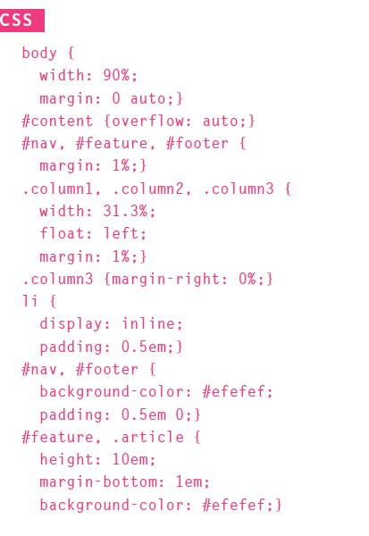

# Layout

Key Concepts in
Positioning Elements

Building Blocks
CSS treats each HTML element as if it is in its
own box. This box will either be a block-level
box or an **inline box**.

Block-level elements
start on a new line
Examples include:
`<h1> 
 <ul> <li>`

Inline elements
flow in between
surrounding text
Examples include:
` <b> <i>`

**Containing Elements**

if one block-level element sits inside another
block-level element then the outer box is
known as the containing or parent element.

***It is common to group a number of elements together inside a `
`***

**Controlling the Position of Elements**
CSS has the following positioning schemes that allow you to control
the layout of a page: normal flow, relative positioning, and absolute
positioning. *You specify the positioning scheme using the position
property in CSS. You can also float elements using the **float** property.*

1. Normal flow  `position:static`

    In normal flow, each block-level
element sits on top of the next
one. Since this is the default
way in which browsers treat
HTML elements.

2. Relative Positioning `position:relative`
3. Absolute positioning `position:absolute`
4. Fixed Positioning
`position:fixed`

Overlapping Elements  `z-index`

When you use relative, fixed, or
absolute positioning, boxes can
overlap. If boxes do overlap, the
elements that appear later in the
HTML code sit on top of those
that are earlier in the page.

Floating Elements `float`

`float: right;`

`float: left;`

Clearing Floats
`clear`

**`left`**
The left-hand side of the box
should not touch any other
elements appearing in the same
containing element.

**`right`**
The right-hand side of the
box will not touch elements
appearing in the same containing
element.

**`both`**
Neither the left nor right-hand
sides of the box will touch
elements appearing in the same
containing element.

**`none`**
Elements can touch either side.
In this example, the fourth
paragraph has a class called
clear. 

## Screen Sizes
Different visitors to your site will have different sized screens that show
different amounts of information, so your design needs to be able to
work on a range of different sized screens.

**Screen Resolution**

Resolution refers to the number of dots a screen shows per inch. Some
devices have a higher resolution than desktop computers and most
operating systems allow users to adjust the resolution of their screens.

**Fixed Width Layouts**
Fixed width layout
designs do not
change size as the
user increases
or decreases
the size of their
browser window.
Measurements tend
to be given in pixels.

**A Liquid Layout**

The liquid layout uses
percentages to specify the width
of each box so that the design
will stretch to fit the size of the
screen.

